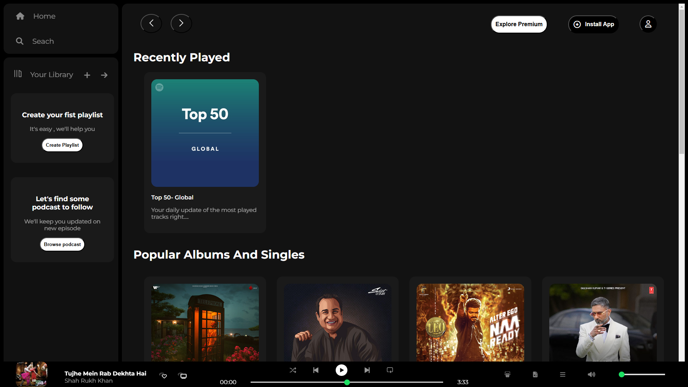
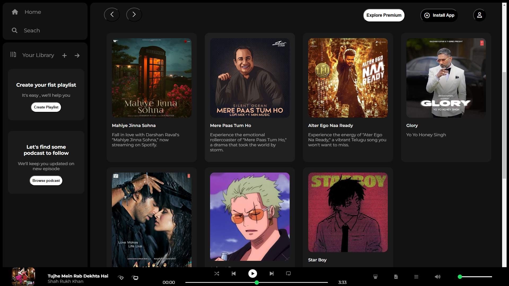

# 🎵 Spotify-Replica
A visually appealing and responsive Spotify clone built using HTML & CSS, designed to replicate the look and feel of the original Spotify web player. 
This project aims to provide an intuitive and immersive UI experience similar to Spotify's official web application.

## ⭐ features

✅ _**Sidebar Navigation**_ – &nbsp; Home, Search, and Library options for seamless browsing.  
✅ _**Dynamic Main Content**_ – &nbsp; Showcases recently played songs, popular albums, and featured charts. 
✅ _**Interactive Music Player UI**_ – &nbsp; Positioned at the bottom, featuring playback controls (UI only). 
✅ _**Modern UI & Smooth Transitions**_ – &nbsp;Clean layout with hover effects and animations. 
✅ _**Fully Responsive**_ –&nbsp; Adapts to various screen sizes for an optimal experience. 
✅ _**Custom Card Designs**_ –&nbsp; Each playlist and album is represented with stylish, interactive cards. 
✅ _**Hover Effects & Animations**_ – &nbsp;Enhances user engagement with smooth transitions. 

## 🎨 Design Breakdown

The Spotify Replica is structured into three primary sections:

1️⃣ _**Sidebar Navigation**_ – &nbsp;Includes essential navigation links such as Home, Search, and Your Library. Styled with flexbox and CSS transitions to enhance user experience. 
2️⃣ _**Main Content Area**_ – &nbsp;Displays playlists, recently played tracks, and featured charts. Uses grid and flexbox for a structured, responsive layout. 
3️⃣ _**Music Player UI**_ – &nbsp;&nbsp;&nbsp;&nbsp;&nbsp;&nbsp;A fixed bottom panel with playback controls, volume adjustment, and progress bar styling. The layout is designed to match the original Spotify web app. 

## 🛠️ Technologies Used

- _**HTML5**_ – &nbsp;Structuring the web page content.

- _**CSS3**_ – &nbsp;Styling with flexbox, grid, and animations.

- _**Font Awesome**_ –&nbsp; Icons for UI elements.

- _**Google Fonts**_ – &nbsp;Montserrat font for a sleek look.

## 📂 Project Structure

 📁 **spotify replica.html** – &nbsp;The main structure of the web application. 
 📁 **spotify replica.css** – &nbsp;Styling for the Spotify interface. 
 📁 **Assets Folder** –&nbsp; Icons, images, and other visual elements. 

## 🚀 Getting Started

Follow these steps to run the project on your local system:

- 1️⃣ **Clone the repository**:

           git clone https://github.com/Rajgopal7/Spotify-Replica.git
- 2️⃣ **Navigate to the project directory**:

           cd spotify-replica

- 3️⃣ Open **Spotify Replica.html** in your browser, and enjoy the UI experience! 🎶

## 🔮 Future Enhancements

🔹 _**JavaScript Integration**_ – &nbsp;To enable actual music playback. 
🔹 _**API Integration**_ –&nbsp;Fetch real-time song data from the Spotify API. 
🔹 _**Advanced Responsiveness**_ –&nbsp; Further optimize UI for all devices. 
🔹 _**Dark & Light Modes**_ –&nbsp; Allow users to switch between themes for better user experience. 
🔹 _**Playlist Management**_ – &nbsp;Add functionality to create, edit, and manage playlists dynamically. 

## 🤝 Contributing

Have an idea for improvement? Fork the repo and submit a pull request! Contributions are always welcome. 🙌

## 📜 License

This project is open-source and available under the MIT License.

## 📸 Preview

 
 

Made with ❤️ _**by Rajgopal Sinha**_

